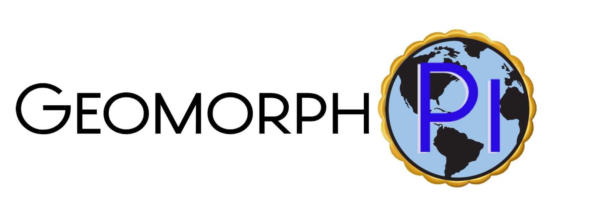

# What is GeomorphPi?

GeomorphPi is an opensource venture to create a platform to enable researchers and the public to monitor the world around them. It can provide the basis for data collection in areas where commercial platforms are too costly or not flexible enough to meet the requirements of the researcher. GeomorphPi is also to designed to enable an individual to montitor their own environment.

